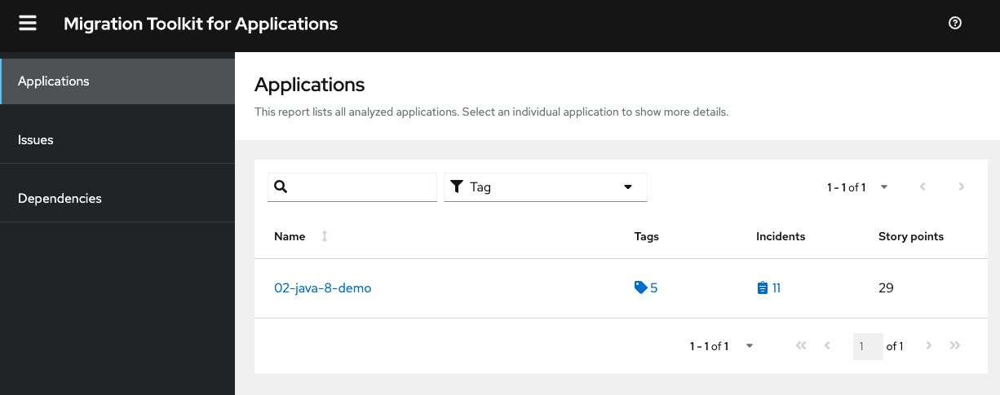
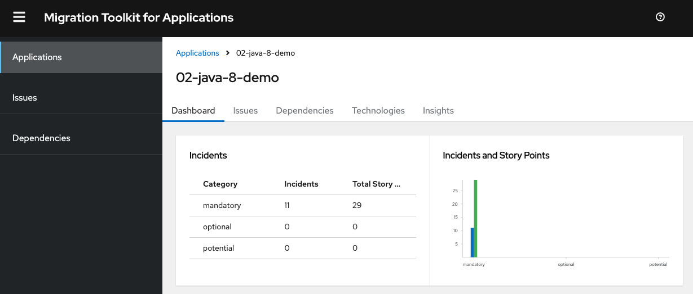
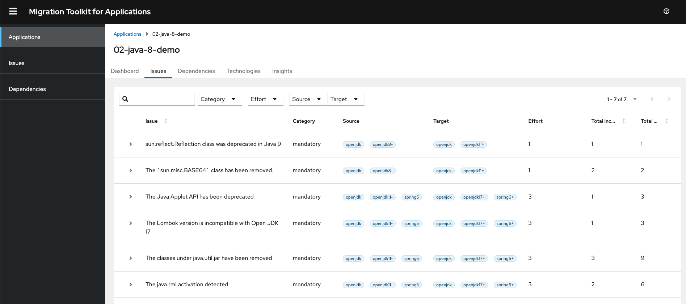

# Migrating Java 8 to Java 17 Example

## System Requirements

* Make sure you have the [Migration Toolkit for Applications CLI](https://docs.redhat.com/en/documentation/migration_toolkit_for_applications/7.2/html-single/cli_guide/index#installing-cli-tool_cli-guide) installed.

* Confirm the installation: `mta-cli version`

```
version: 7.2.1
SHA: 4c757335ce396d3dc2e18fcc0ebecbf4675bb171
image: registry.redhat.io/mta/mta-cli-rhel9:7.2.1
```

* This example is based on MTA version 7.2.1

## Set up

1. Clone the github repo

```
  git clone https://github.com/darbyredhat/migration-toolkit-applications-examples.git
```

2. Move into the directory

```
cd 02-java-demo
```
## Run MTA Analysis

1. Run the following command

```
./mta-cli analyze \
--input ../02-java-8-demo \
--output report-output/ --overwrite \
--source openjdk8 \
--target openjdk17
```

* Here's a description of the command

  * `mta-cli analyze`
    * This is the main command to analyze an application using the Migration Toolkit for Applications.

  * `--input ../02-java-8-demo`
    * Specifies the path to the source code or application to be analyzed. In this case, the application is located in a directory named ../02-java-8-demo.

  * `--output report-output/`
    * Specifies the directory where the analysis report will be generated. Here, the report will be saved in a folder named report-output.

  * `--overwrite`
    * Ensures that if a report already exists in the specified report-output directory, it will be overwritten by the new analysis results.

  * `--source openjdk8`
    * Defines the source runtime environment the application is currently using.  Here, the source environment is OpenJDK 8.

  * `--target openjdk17`
    * Specifies the target runtime environment to which you intend to migrate the application. Here, the target environment is OpenJDK 17.

2. You will see the following output.

```
INFO[0000]
 --run-local set. running analysis in containerless mode
INFO[0000] running source analysis
INFO[0000] creating provider config
INFO[0000] setting provider from provider config         provider=java
INFO[0000] setting provider from provider config         provider=builtin
INFO[0000] parsing rules for analysis                    rules=/Users/demo/dev-mta/mta-7.2.1-cli-darwin-arm64/rulesets
INFO[0000] starting provider                             provider=builtin
INFO[0000] starting provider                             provider=java
INFO[0005] running depencency analysis
INFO[0005] evaluating rules for violations. see analysis.log for more info
INFO[0010] writing analysis results to output            output=/Users/demo/dev-mta/mta-7.2.1-cli-darwin-arm64/report-output
INFO[0010] generating static report
INFO[0010] Static report created. Access it at this URL:  URL="file:///Users/demo/dev-mta/mta-7.2.1-cli-darwin-arm64/report-output/static-report/index.html"
```


## Reviewing the reports

1. The reports are at the location: `${report-output}/index.html`. Open the `index.html` file with a web browser.



2. This opens a landing page that lists the applications that were processed. Each row contains a high-level overview of the story points, number of incidents, and technologies encountered in that application.

### Application Report

#### Dashboard 

1. Access the Dashboard from the report landing page by clicking on the application name in the Application List.



2. The dashboard gives an overview of the entire application migration effort. It summarizes:
* The incidents and story points by category
* The incidents and story points by level of effort of the suggested changes
* The incidents by package

#### Issues Report

1. Access this report from the dashboard by clicking the *Issues* link.



2. This report includes details about every issue that was raised by the selected migration paths. The following information is provided for each issue encountered:
* A title to summarize the issue.
* The total number of incidents, or times the issue was encountered.
* The rule story points to resolve a single instance of the issue.
* The estimated level of effort to resolve the issue.
* The total story points to resolve every instance encountered. This is calculated by multiplying the number of incidents found by the story points per incident.


3. Each reported issue may be expanded, by clicking on the title, to obtain additional details. The following information is provided.
  * A list of files where the incidents occurred, along with the number of incidents within each file. If the file is a Java source file, then clicking the filename will direct you to the corresponding Source report.
  * A detailed description of the issue. This description outlines the problem, provides any known solutions, and references supporting documentation regarding either the issue or resolution.
